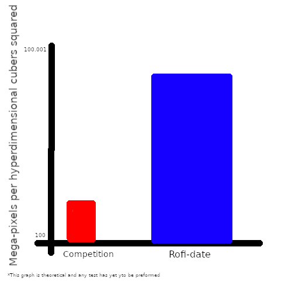

# Rofi-date

A [_Blazingly Fast_](#preformance) **Hyper-opionated** Datetime utility for rofi.

## Installing

First you will need to install dependacies:
For arch this is:

```
Sudo pacman -S -needed rofi meson glib2
```

If you are on wayland, you may elect to isntall the `rofi-wayland` package instead.
To build from source, clone the repo and build with meson:

```
git clone https://github.com/octrillion/rofi-date.git &
cd rofi-date &
meson setup build &
meson compile -C build
```

Then run `meson install -C build` to install plugin to '/var/lib/rofi'
Note: this command requires sudo privilages.

You can now run the plugin with `rofi -show date`
Have Fun!! 😄

## Preformance

Look at this legit graph to see the preformance over _leading_ **industry competition**:


